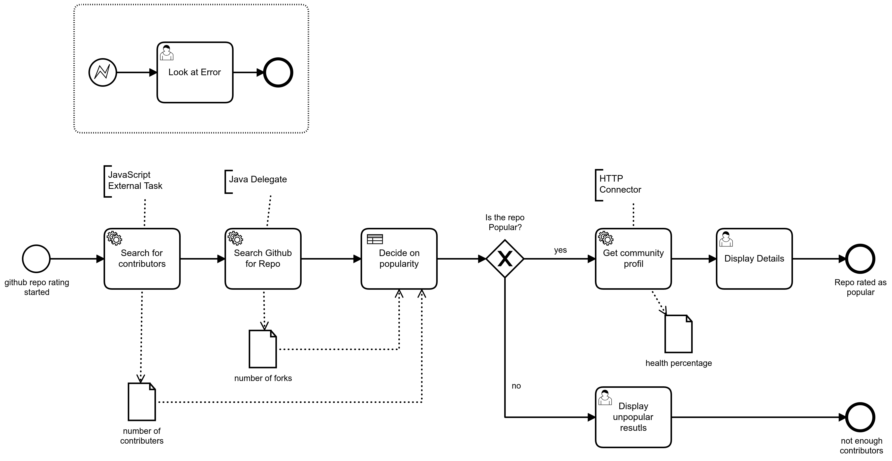
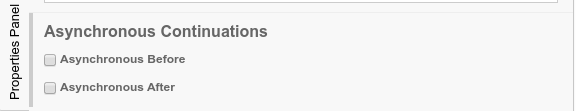
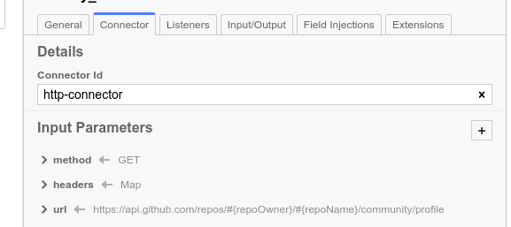
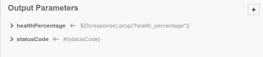

# Make REST calls from Camunda Platform 7 Example

This document outlines an example project, and four ways to make REST calls from Camunda Platform 7 to external systems. Each method offers a series of pros and cons, but this document aims to provide a better understanding as to which method may be the best option for a given requirement and user.  


 This document outlines implementation of the following:

* [Java Delegates](https://docs.camunda.org/manual/latest/user-guide/process-engine/delegation-code/)
  * Where the call is made within a local Java Class, called by the engine.
* [External Task](https://docs.camunda.org/manual/latest/user-guide/process-engine/external-tasks/)
  * Where the call is made by an external piece of software, running independently from the engine.
* [Connectors](https://docs.camunda.org/manual/latest/user-guide/process-engine/connectors/)
  * Where the call is made by the engine, using properties added directly to the XML of the process model. 
* [Script](https://docs.camunda.org/manual/latest/user-guide/process-engine/scripting/)
  * Where the call is made by the engine, executing a script. The script can be added directly to the XML or be maintained as an external ressource.

Within a process, the three first implementation methods can implement a BPMN [Service Task](https://docs.camunda.org/manual/latest/reference/bpmn20/tasks/service-task/). The best practice guide provides a good [overview of the different options for the implementation of service taks](https://camunda.com/best-practices/invoking-services-from-the-process/). Script can be implemented within a [Script Task](https://docs.camunda.org/manual/latest/reference/bpmn20/tasks/script-task/).

Additionally, [Task Listeners](https://docs.camunda.org/manual/latest/user-guide/process-engine/delegation-code/#execution-listener) and [Execution Listeners](https://docs.camunda.org/manual/latest/user-guide/process-engine/delegation-code/#execution-listener) can implement Java Delegates and Script.

This project uses three Service Tasks and one Script Task to outline the different implementation methods. The following image outlines the process:



:exclamation: **Important:**  
If a REST call returns a `2xx` status code, this indicates a successful call. However, it should not be assumed other codes such as `5xx` or `4xx` will automatically lead to an error within the process. Instead, this can be implemented and handled depending on the requirements for each project. For more information, read the [explanation of the implementations](#explanation-of-the-implementations) section below.

## Run the project

The project contains a **Camunda Spring Boot** application and a [JavaScript External Task Worker](https://github.com/camunda/camunda-external-task-client-js). To run the project and start a process instance in Tasklist, follow the steps below:

1. Download the project and open the **Camunda Spring Boot** application in your IDE using Java 11.
2. Start the application.
3. Start a process instance of the process in Tasklist using the predefined start form, or start the instance via REST.
4. If you [start the instance via REST](https://docs.camunda.org/manual/latest/reference/rest/process-definition/post-start-process-instance/) make sure the necessary variables are included.

Example for the Request body:

```Json
{
  "variables": {
    "repoName" : {
        "value" : "Name of Repo",
        "type": "String"
    },
    "repoOwner" : {
      "value" : "Name of Repo Owner",
      "type": "String"
    }
  },
 "businessKey" : "myBusinessKey"
}

```

5. Navigate to the folder of the **Javascript External Task** client. Make sure you have npm installed and install the needed packages with an:

```
npm update
```

6. Run the worker.

```
node service.js
```

## Explanation of the implementations

This section provides more information on each implementation. This section also shows how the response code and the information from the response body can be used differently. 

In this project, a response code that is anything except `200` will create an incident. The information of the response body is either used to complete the task, or used to throw a BPMN error.

No matter how you implement the call, there three main options as to how a Service Task can behave:

* Complete the task successfully (use the information from the REST call to route the further process.)
* Throw a [BPMN error](https://docs.camunda.org/manual/latest/reference/bpmn20/events/error-events/) (information gained from the REST call leads to an error that should be handled within the logic of the process.)
* Create an [incident](https://docs.camunda.org/manual/latest/user-guide/process-engine/incidents/) (information from the REST call leads to a fail and creates an incident in the workflow engine. This will require an administrator to resolve.)

### Java Delegate

A **Java Delegate** is called during the execution, and must implement the **JavaDelegate** interface. In this example, the Java Class is deployed to the Camunda Engine.

:file_folder: **Note:**  
The explanation divides the code into different pieces to outline the different concepts. The full class can be found within [this project](Make-Rest-Calls-From-Camunda-Example/CamundaApllication/src/main/java/com/example/workflow/FindGitHubRepo.java).

The first part of the class gets the process variables `repoOwner` and `repoName`. These variables are used to perform the REST call within the Java code:

```java
@Named
public class FindGitHubRepo implements JavaDelegate {

    @Override
    public void execute(DelegateExecution execution) throws Exception {

        String repoOwner = (String) execution.getVariable("repoOwner");
        String repoName = (String) execution.getVariable("repoName");


        HttpResponse<String> response = get("https://api.github.com/repos/" + repoOwner + "/" + repoName);

```

The `get` method being called in the above snippet simply implements the rest call using the Java9 HTTP client

```Java
    public HttpResponse<String> get(String uri) throws Exception {
        HttpClient client = HttpClient.newHttpClient();
        HttpRequest request = HttpRequest.newBuilder()
                .uri(URI.create(uri))
                .build();

        HttpResponse<String> response =
                client.send(request, HttpResponse.BodyHandlers.ofString());

        System.out.println(response.body());

        return response;
    }

```

#### Create an incident

The code example then checks the status code. If the response code is not `200`, an exception will be thrown. Within the code, this exception is not handled. Therefore, this will lead to an incident within the Camunda Platform Engine.

```java
 if (response.statusCode() != 200) {

            // create incidence if Status code is not 200
            throw new Exception("Error from REST call, Response code: " + response.statusCode());

        } 

```

:exclamation: **Important:**   
Ensure you understand [transactions](https://docs.camunda.org/manual/latest/user-guide/process-engine/transactions-in-processes/) within the Camunda workflow engine. Depending on where your last transaction in the process is, the state of the process will roll back to the last transaction. Note that this may not be the service task where the error occurred. You can set transactions manually by using the **async before and after** flag in the modeler.



#### Throw a BPMN error

If the response code is `200`, the example code receives the response body and parses for the entry of `downloads`. If the value of downloads is `false`, the code throws a BPMN error. This error can then be handled by the logic of the process:

```java
 } else {

            //getStatusText
            String body = response.body();
            JSONObject obj = new JSONObject(body);
            //parse for downloads
            Boolean downloads = obj.getBoolean("has_downloads");

            if (!downloads) {

                // Throw BPMN error
                throw new BpmnError("NO_DOWNLOAD_OPTION", "Repo can't be downloaded");

            }

```

#### Complete the task

If the two prior checks do not trigger the exception or the BPMN error, the example code parses the response body for the number of forks. This will set the variable to the process and the task complete.

```java
} else {
  //parse for forks
                String forks = obj.getString("forks");
                int forksAsNumber = Integer.parseInt(forks);
                //Set variables to the process
                execution.setVariable("forks", forksAsNumber);

            }
```

### External Task

An external task is written into a list. Next, an external task worker fetches and locks it using Camunda's REST API, and the external task workers deploy independently and are therefore language independent. There is a [list with available clients in different languages](https://github.com/camunda/awesome-camunda-external-clients) you may refer to. This project uses the JavaScript external task client.

:file_folder: **Note:**  
 The explanation divides the code into different pieces to outline the different concepts. The full code example can be found within [this project](Make-Rest-Calls-From-Camunda-Example/SearchContributorService/service.js).

With the External Task client, it is possible to get variables from the process. These variables are then used to make a REST call in Javascript code:

```javascript
client.subscribe("searchContributors", async function({ task, taskService }) {

    const repoName = task.variables.get("repoName");
    const repoOwner = task.variables.get("repoOwner");
 
const url = "https://api.github.com/repos/"+ repoOwner +"/" + repoName + "/contributors"
console.log(url)

try{
const contributors = await fetch(url)
```

#### Create an incident

Again, we check the JavaScript code for the response code. If the code does not equal `200`, we throw an error. Later in our JavaScript code, we handle the error and use the External Task client to send back a failure to the workflow engine. This failure will then create an incident. If the response code equals `200`, the response body is returned:

```javascript
.then(function(response) {    
    if (!response.ok) {
       // throw Exception;
       var e = new Error("HTTP status " + response.status); // e.name is 'Error'
       e.name = 'RestError';
       throw e;
    }
    return response.json();
})

...

// Handle Exception and create an incidence in Workflow Engine
}catch (e){
    await taskService.handleFailure(task, {
        errorMessage: e.name,
        errorDetails: e.message,
        retries: 0,
        retryTimeout: 1000
      });

}

```

#### Throw a BPMN error

Next, the information of the response body is used. The example uses the information of the number of contributors. If the number is smaller or equals **one**, the external task worker sends back a BPMN Error:

```javascript
var numberContributors = Object.keys(contributors).length;

if(numberContributors <= 1){
    const processVariables = new Variables();
    processVariables.set("errorMessage", "Sorry the repo has just one or none contributor, look for another one");
    await taskService.handleBpmnError(task, "NO_CONTRIBUTORS", "The repo has no contributors", processVariables);
}

```

#### Complete the task

If there is more than one contributor, the External Task worker uses the client method to complete the task and send back variables to the process:

```javascript
//Complete Task
const processVariables = new Variables();
processVariables.set("contributors", numberContributors);
await taskService.complete(task, processVariables)
```

### Connectors

The two previous examples implemented the REST call within their code. Beneficially, everything is together in one place and the user can easily handle the different outcomes.

**Connectors** within Camunda provide an API for simple HTTP and SOAP connections; there is no need to implement the REST call with code. However, handling the different outcomes is more complicated and requires Script.

:exclamation: **Important:**  
Be aware of the other two options. Depending on how complicated the REST call and the proceeding of the response becomes, the other options above may be more suitable.

To use **Connectors** and the http client, the connect dependency and the http client must be added to the POM file:

```xml
    <dependency>
      <groupId>org.camunda.bpm</groupId>
      <artifactId>camunda-engine-plugin-connect</artifactId>
    </dependency>

    <dependency>
      <groupId>org.camunda.connect</groupId>
      <artifactId>camunda-connect-http-client</artifactId>
    </dependency>
```

To parse the response body, it may be helpful to include the [Spin Plugin](https://docs.camunda.org/manual/latest/reference/spin/) as well. To add Spin and JSON, add the dependencies to the POM file.

```xml
    <dependency>
      <groupId>org.camunda.bpm</groupId>
      <artifactId>camunda-engine-plugin-spin</artifactId>
    </dependency>

    <dependency>
      <groupId>org.camunda.spin</groupId>
      <artifactId>camunda-spin-dataformat-json-jackson</artifactId>
    </dependency>
```

This [project](https://github.com/rob2universe/camunda-http-connector-example) shows a simple use case for **Connectors**.

To configure the **Connector**, the **Input Parameters** must be set.

To configure a **GET** call, the method, the url, and the headers must be set:



The configuration of the **Connector** allows setting output variables:



The response code can be accessed easily with the Expression:

```
${statusCode}
```

To parse the body, we use an Expression in combination with Spin:

```
${S(response).prop("health_percentage")}
```

#### Create an incident

Similar to the examples above, the **Connector** should create an incident if the response code is not `200`.

:exclamation: **Important:**  
Ensure you understand [transactions](https://docs.camunda.org/manual/latest/user-guide/process-engine/transactions-in-processes/) within the Camunda workflow engine. Depending on where your last transaction in the process is, the state of the process will roll back to the last transaction, which might not be the service task where the error occurred. You can set transactions manually by using the **sync before and after** flag in the modeler.


To observe the incident at the right place in this project, the **async before** flag is set. This will also ensure the transaction isn't rolled back too far. 

The response code is defined as an output variable. To check the value of the variable, the project uses [Script](https://docs.camunda.org/manual/latest/user-guide/process-engine/scripting/). Script can be used at various places. For example, Script can be used directly by defining the output variable of a **Connector**. This example uses Script as an [Execution Listener](https://docs.camunda.org/manual/latest/user-guide/process-engine/scripting/#use-scripts-as-execution-listeners) at the end of the **Connector**.


If the response code does not equal `200`, the Script throws an error. As the error is not handled, this leads to an incident within the workflow engine.

:bangbang: **cases to consider:**  
In this project, the incident will be created before. If the response is not `200`, the response body will look different. Therefore, the Expression we use to store the health percentage ```${S(response).prop("health_percentage")}``` fails. The accompanying incident message won't give details about the failed REST call. Rather, it shares that the evaluation of the expression has failed. This outlines one of the challenges working with **Connectors**. If the evaluation of the response code and the different variables is handled within the same code, it is easier to maintain the outcome and the logic.


#### Throw a BPMN error

The example uses the gained information about the health percentage. An **Execution Listener** at the end of the connector is used to evaluate the value of the variable.

```javascript
health = execution.getVariable("healthPercentage");

if(health < 70){

execution.setVariable("healthPercentage", health);
throw new org.camunda.bpm.engine.delegate.BpmnError("error-not-healthy");

}else{
execution.setVariable("healthPercentage",health);
}
```

#### Complete the task

With a **Connector**, the task completes after calling the REST endpoint.

#### Logging Connectors

To get more output about the traffic with the called service, you can use these logging configuration in the `application.yaml` file:

```yaml
logging:
  level:
    '[org.camunda.bpm.connect]': DEBUG
    '[org.apache.http.headers]': DEBUG
    '[org.apache.http.wire]': DEBUG
    '[connectjar.org.apache.http.headers]': DEBUG
    '[connectjar.org.apache.http.wire]': DEBUG 
```

The levels are preconfigured to `INFO` in the `application.yaml` of this project.


### Script Task

Scripting can be used in a variety of places within the process, including dedicated script tasks. In some distributions of Camunda the groovy engine is already included. For spring boot it needs to be added as a dependency.

```XML
    <dependency>
      <groupId>org.codehaus.groovy</groupId>
      <artifactId>groovy-all</artifactId>
      <version>3.0.8</version>
      <type>pom</type>
    </dependency>
```

JavaScript is part of the Java Runtime (SRE) until version 15. The Nashorn JavaScript Engine is removed in Java 15. 

To use another scripting language that is compatible with JSR-223 the respective jar file has to be added to the classpath. 

:exclamation: **Important:**  
Normally Script is not that common to make a REST call within Camunda

This example uses Groovy to make the REST call. With the Script, it is possible to get variables from the process. These variables are then used to make a REST call in the Groovy script:

```java
def repoOwner = execution.getVariable("repoOwner")
def repoName = execution.getVariable("repoName")

RESTClient client = new RESTClient("https://api.github.com/")
def path = "/repos/"+ repoOwner +"/"+ repoName +"/languages"
def response

```
The script uses then the information from the response to set the variables true, if the response body contains a certain language: 
```java

    if(response.contentAsString.contains("Java")){
        java = true;
        programingLanguages = programingLanguages + " Java "
    }

```

#### Create an incident

Within the script an uncaught exception will create an incident in the engine. In this example we catch any exception from the RESTClient, print the exception to the console and then throw a new exception, which is not be caught and create the incident.

```java
catch (RESTClientException e) {
    println(e)
    throw new Exception(e)
}    
```


#### Throw a BPMN error

BPMN errors can be thrown based on the response from the REST call. The example script throws a BPMN error as soon as Scala is included in the response body:

```java
    if(response.contentAsString.contains("Scala")){
        scala = true;
        programingLanguages = programingLanguages + " Scala "

        throw new org.camunda.bpm.engine.delegate.BpmnError("error-scala-detected");
    }  
```

#### Complete the task

If the try block runs successfully without the execution of the if statement for scala the task will complete and the variables are set back to the process instance.

```java
   //return variables
    execution.setVariable("programingLanguages", programingLanguages)
    execution.setVariable("java", java)
    execution.setVariable("javaScript", javaScript)
    execution.setVariable("python", python)
    execution.setVariable("ruby", ruby)
    execution.setVariable("closure", closure
```
